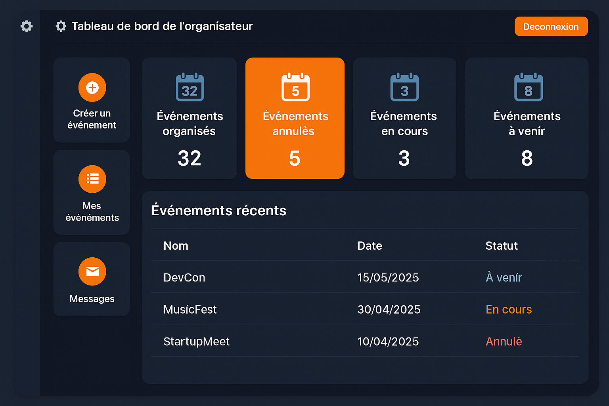

# 🎯 Distributed Event Management System (JavaFX + Design Patterns)

# SOMMAIRE
-[🎯 Distributed Event Management System (JavaFX + Design Patterns)](#-distributed-event-management-system-javafx--design-patterns)
-[📑 Sommaire](#sommaire)

-[📌 Contexte](#-contexte)

 -[❗ Problématique](#-problématique)

 -[🎯 Objectifs](#-objectifs)

 -[ 🧠 Présentation du projet](#-présentation-du-projet)

 -[ 📷 Aperçu (Captures d’écran)](#-aperçu-captures-décran)

 -[🧱 Technologies utilisées](#-technologies-utilisées)

 -[👤 Auteur](#-auteur)


  -[📌 Exécution](#-exécution)

 -[📈 Évolutions futures](#-évolutions-futures)

 -[📞 Contact](#-contact)

 -[⚖️ Licence](#️-licence)
---

## 📌 Contexte

Dans un contexte de gestion d'événements au sein d’organisations décentralisées (clubs, associations, institutions militaires, etc.), il devient crucial de disposer d’une solution efficace, intuitive et distribuée. Les outils classiques (papier, messageries instantanées, Excel) atteignent rapidement leurs limites en termes de coordination, de traçabilité et de performance.

---

## ❗ Problématique

Comment concevoir un système distribué qui permette :

- Une organisation fluide et automatisée des événements
- Une notification intelligente des participants
- Une bonne structuration de la communication entre acteurs distants
- Une architecture évolutive avec des modèles métiers solides

---

## 🎯 Objectifs

- Mettre en place une application Java orientée objet, robuste et extensible
- Implémenter des design patterns tels que Singleton, Observer, Factory, Strategy
- Gérer des événements (création, annulation, participation)
- Assurer une communication distribuée simulée entre organisateurs et participants
- Offrir une interface utilisateur moderne avec **JavaFX**

---

## 🧠 Présentation du projet

Ce projet est une application de gestion d’événements distribués construite en Java, avec une interface utilisateur JavaFX moderne. Elle permet à des organisateurs d’événements :

- de créer des événements,
- de notifier les participants,
- et de gérer dynamiquement les inscriptions ou désinscriptions.

Les participants peuvent être notifiés via différents canaux simulés : Email,Console, JSON, XML (grâce à des sérialisateurs). L'application suit une architecture **orientée objet**, avec des **tests unitaires JUnit** intégrés.

> Le projet est académique, mais conçu pour être facilement extensible vers une architecture réelle REST ou microservices avec Spring Boot.

---

## 📷 Aperçu (Captures d’écran)


---

## 🧱 Technologies utilisées

- Java 23
- JavaFX 21
- JUnit 5
- Gson, JAXB
- Gradle / Maven
- Design Patterns (Observer, Singleton, Factory, Strategy)
- UML (PlantUML)

---

## 👤 Auteur

- **Nom** : Azangue Léonel
- **WhatsApp** : +237 657 450 314
- **Email** : azangueleonel9@gmail.com
- **GitHub** : [Delmat237](https://github.com/Delmat237)
- **LinkedIn** : [leonel-azangue](https://www.linkedin.com/in/leonel-azangue)


## 📌 Exécution

Pour lancer le projet :

git clone https://github.com/Delmat237/distributed-event-manager.git
cd distributed-event-manager
./gradlew run

    Ou exécute la classe Main depuis ton IDE favori (IntelliJ, Eclipse…).

## 📈 Évolutions futures

    Intégration Spring Boot (REST API)

    Base de données PostgreSQL

    Authentification et rôles (organisateur / participant)

    Système de notifications en temps réel

## 📞 Contact

Pour toute question ou collaboration, n’hésite pas à me contacter via WhatsApp, GitHub ou LinkedIn ci-dessus.


---

## ⚖️ Licence

Ce projet est sous licence MIT. Voir le fichier [LICENSE](./LICENSE) pour plus d’informations.

````markdown
    MIT License

    Copyright (c) 2025 Leonel Azangue

    Permission is hereby granted, free of charge, to any person obtaining a copy
    of this software and associated documentation files (the “Software”), to deal
    in the Software without restriction...
```